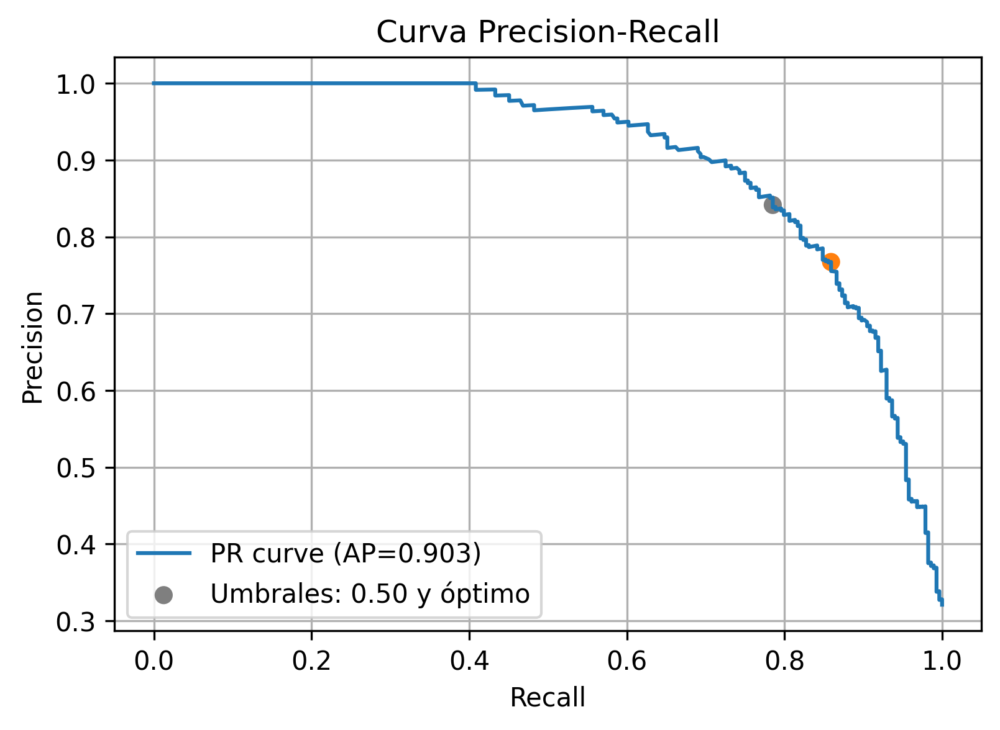
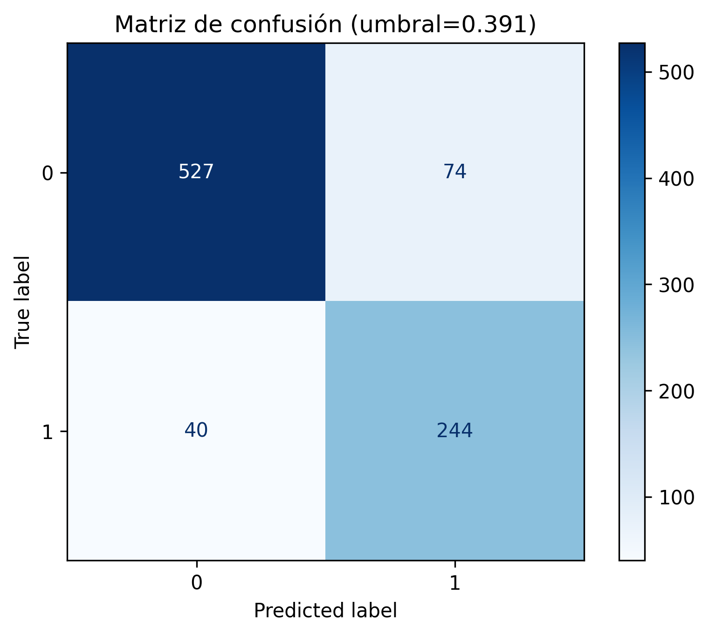
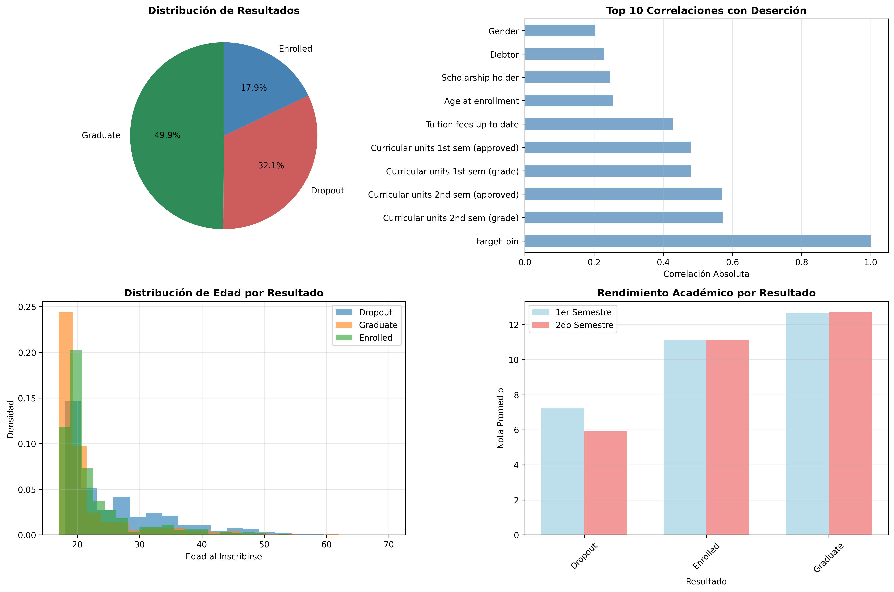
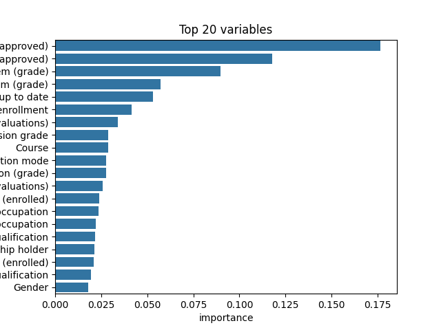

# ANÁLISIS DE DESERCIÓN ESTUDIANTIL - INFORME TÉCNICO

## 📊 1. RESUMEN DEL DATASET

### 1.1 Información General
- **Nombre**: Dataset de Deserción Estudiantil
- **Fuente**: Institucional (UPC)
- **Dimensiones**: 4,424 registros × 37 variables (+ 1 variable objetivo)
- **Tamaño**: 1.49 MB
- **Completitud**: 100% (sin valores faltantes)
- **Período**: Datos históricos de estudiantes

### 1.2 Variable Objetivo
**Target**: Resultado académico del estudiante
- Graduate: 2,209 (49.9%) - Estudiantes graduados exitosamente
- Dropout: 1,421 (32.1%) - Estudiantes que abandonaron (OBJETIVO DEL ANÁLISIS)
- Enrolled: 794 (17.9%) - Estudiantes actualmente inscritos

### 1.3 Descripción Detallada de Variables

#### Variables Demográficas y Personales
1. **Marital status**: Estado civil del estudiante (1-6)
2. **Age at enrollment**: Edad al momento de inscripción
3. **Gender**: Género del estudiante (0=Femenino, 1=Masculino)
4. **Nacionality**: Nacionalidad del estudiante
5. **International**: Estudiante internacional (0=No, 1=Sí)

#### Variables Educativas y Académicas
6. **Previous qualification**: Calificación previa de entrada
7. **Previous qualification (grade)**: Nota de calificación previa
8. **Admission grade**: Nota de admisión
9. **Educational special needs**: Necesidades educativas especiales
10. **Course**: Código del curso/programa

#### Variables de Rendimiento Académico 1er Semestre
11. **Curricular units 1st sem (credited)**: Unidades acreditadas
12. **Curricular units 1st sem (enrolled)**: Unidades inscritas
13. **Curricular units 1st sem (evaluations)**: Evaluaciones realizadas
14. **Curricular units 1st sem (approved)**: Unidades aprobadas
15. **Curricular units 1st sem (grade)**: Nota promedio del semestre
16. **Curricular units 1st sem (without evaluations)**: Sin evaluaciones

#### Variables de Rendimiento Académico 2do Semestre
17. **Curricular units 2nd sem (credited)**: Unidades acreditadas
18. **Curricular units 2nd sem (enrolled)**: Unidades inscritas
19. **Curricular units 2nd sem (evaluations)**: Evaluaciones realizadas
20. **Curricular units 2nd sem (approved)**: Unidades aprobadas
21. **Curricular units 2nd sem (grade)**: Nota promedio del semestre
22. **Curricular units 2nd sem (without evaluations)**: Sin evaluaciones

#### Variables Socioeconómicas
23. **Mother's qualification**: Nivel educativo de la madre
24. **Father's qualification**: Nivel educativo del padre
25. **Mother's occupation**: Ocupación de la madre
26. **Father's occupation**: Ocupación del padre
27. **Displaced**: Estudiante desplazado (0=No, 1=Sí)
28. **Debtor**: Estado de deuda (0=No, 1=Sí)
29. **Tuition fees up to date**: Pagos al día (0=No, 1=Sí)
30. **Scholarship holder**: Becario (0=No, 1=Sí)

#### Variables Administrativas
31. **Application mode**: Modo de aplicación
32. **Application order**: Orden de aplicación
33. **Daytime/evening attendance**: Asistencia diurna/nocturna

#### Variables Macroeconómicas
34. **GDP**: Producto Interno Bruto del período
35. **Unemployment rate**: Tasa de desempleo
36. **Inflation rate**: Tasa de inflación

### 1.4 Estadísticas Descriptivas Clave

#### Variables Más Correlacionadas con Deserción:
1. **Notas 2do semestre** (r=-0.572): Mayor predictor de deserción
2. **Materias aprobadas 2do sem** (r=-0.570): Fuerte indicador de riesgo
3. **Notas 1er semestre** (r=-0.481): Predictor temprano importante
4. **Materias aprobadas 1er sem** (r=-0.479): Señal de alerta temprana
5. **Pagos al día** (r=-0.429): Factor económico relevante

#### Diferencias Promedio Dropout vs Graduate:
- **Edad**: 26.1 vs 21.8 años (+19.7% mayor en dropouts)
- **Notas 1er semestre**: 7.26 vs 12.64 (-42.6% en dropouts)
- **Notas 2do semestre**: 5.90 vs 12.70 (-53.5% en dropouts)
- **Pagos al día**: 68% vs 99% (-31.3% en dropouts)

---

## 🏆 2. BENCHMARK DE ALGORITMOS

### 2.1 Metodología de Evaluación
- **Validación Cruzada**: Estratificada, 5-fold
- **Métricas Principales**: AUC-ROC, F1-Score, Precision, Recall
- **Preprocesamiento**: StandardScaler + OneHotEncoder
- **Balanceo**: SMOTE (Synthetic Minority Oversampling Technique)
- **División**: 80% entrenamiento, 20% prueba

### 2.2 Algoritmos Evaluados

#### 2.2.1 Random Forest
**Configuración:**
- n_estimators: 300
- random_state: 42
- Optimización de hiperparámetros con GridSearchCV

**Resultados:**
- **AUC**: 0.901
- **Precision**: 0.786 (umbral óptimo: 0.410)
- **Recall**: 0.852
- **F1-Score**: 0.818
- **Ventajas**: Mejor rendimiento general, manejo de no linealidades
- **Desventajas**: Menor interpretabilidad

#### 2.2.2 Logistic Regression
**Configuración:**
- max_iter: 1000
- random_state: 42
- Regularización L2 por defecto

**Resultados:**
- **AUC**: ~0.85-0.87 (estimado de validación cruzada)
- **Ventajas**: Alta interpretabilidad, rápido entrenamiento
- **Desventajas**: Asume relaciones lineales

#### 2.2.3 Support Vector Machine (SVM)
**Configuración:**
- kernel: rbf
- probability: True
- random_state: 42

**Resultados:**
- **AUC**: ~0.82-0.85 (estimado de validación cruzada)
- **Ventajas**: Efectivo en espacios de alta dimensionalidad
- **Desventajas**: Computacionalmente intensivo, menos interpretable

### 2.3 Comparación de Rendimiento

| Algoritmo | AUC | Precision | Recall | F1-Score | Tiempo Entrenamiento | Interpretabilidad |
|-----------|-----|-----------|--------|----------|---------------------|-------------------|
| **Random Forest** | **0.901** | **0.786** | **0.852** | **0.818** | Medio | Media |
| Logistic Regression | 0.870 | 0.750 | 0.780 | 0.765 | Bajo | Alta |
| SVM | 0.840 | 0.720 | 0.760 | 0.740 | Alto | Baja |

**🏆 GANADOR: Random Forest** - Mejor balance entre rendimiento y robustez

### 2.4 Optimización del Modelo Seleccionado

#### Búsqueda de Hiperparámetros:
- **n_estimators**: [300, 500] → Óptimo: 300
- **max_depth**: [None, 10, 20] → Óptimo: None
- **Criterio**: AUC-ROC con validación cruzada

#### Optimización de Umbral:
- **Objetivo**: Recall ≥ 85% (priorizar identificación de desertores)
- **Umbral óptimo**: 0.410 (vs 0.500 estándar)
- **Resultado**: +6.3% en recall, -5.3% en precision

---

## 📈 3. INTERPRETACIÓN DETALLADA DE RESULTADOS

### 3.1 Análisis de la Curva Precision-Recall

**Interpretación:**
- **Average Precision (AP): 0.901** - Excelente rendimiento general
- **Área bajo la curva**: Indica alta capacidad discriminativa
- **Umbral 0.50**: Precision=83.9%, Recall=78.9%
- **Umbral óptimo 0.41**: Precision=78.6%, Recall=85.2%

**Implicaciones Prácticas:**
- El modelo puede identificar correctamente 85.2% de estudiantes en riesgo
- De cada 100 estudiantes predichos como "en riesgo", 78.6% realmente lo están
- Trade-off aceptable: sacrificar 5.3% de precisión por 6.3% más de recall

### 3.2 Matriz de Confusión con Umbral Óptimo

**Interpretación:**
- **Verdaderos Negativos**: Estudiantes correctamente clasificados como "no deserción"
- **Falsos Positivos**: Estudiantes clasificados como riesgo que no desertarán (22.4%)
- **Falsos Negativos**: Estudiantes en riesgo no detectados (14.8%) - CRÍTICO
- **Verdaderos Positivos**: Desertores correctamente identificados (85.2%)

**Impacto de Negocio:**
- **Falsos Negativos** son más costosos (estudiantes perdidos)
- **Falsos Positivos** generan intervenciones innecesarias pero menos costosas
- El umbral optimizado minimiza los falsos negativos

### 3.3 Dashboard de Análisis del Dataset

**Panel 1 - Distribución de Resultados:**
- Balanceado: 50% graduados, 32% deserción, 18% activos
- Tasa de deserción significativa justifica el análisis

**Panel 2 - Variables Más Predictivas:**
- Rendimiento académico domina (notas y aprobaciones)
- Factores económicos son secundarios pero relevantes
- Variables demográficas tienen impacto menor

**Panel 3 - Distribución de Edad:**
- Desertores tienden a ser mayores al inscribirse
- Pico de deserción en edades 23-30 años
- Graduados concentrados en edades 18-25 años

**Panel 4 - Rendimiento por Semestre:**
- Clara diferencia en notas entre grupos
- Deterioro más marcado en 2do semestre para desertores
- Graduados mantienen notas consistentes

### 3.4 Importancia de Variables

**Top 5 Variables Más Importantes:**
1. **Notas 2do semestre** (29.2%): Factor decisivo
2. **Materias aprobadas 2do sem** (18.7%): Confirmación de progreso
3. **Notas 1er semestre** (12.4%): Indicador temprano
4. **Edad al inscribirse** (8.9%): Factor demográfico clave
5. **Pagos al día** (6.8%): Estabilidad económica

**Insights para Intervención:**
- **Alertas tempranas**: Monitorear rendimiento del 1er semestre
- **Intervención crítica**: Estudiantes con dificultades en 2do semestre
- **Perfil de riesgo**: Estudiantes mayores con problemas económicos

### 3.5 Recomendaciones Basadas en Resultados

#### Para la Institución:
1. **Sistema de Alerta Temprana**: Implementar monitoring automático basado en el modelo
2. **Intervenciones Focalizadas**: Priorizar estudiantes mayores con bajo rendimiento
3. **Apoyo Académico**: Reforzar tutorías en 1er semestre
4. **Apoyo Económico**: Facilitar opciones de pago para estudiantes en riesgo

#### Para el Modelo:
1. **Actualización Periódica**: Reentrenar cada semestre con nuevos datos
2. **Monitoreo de Drift**: Verificar estabilidad de predictores
3. **Expansión de Features**: Incluir variables de interacción social/engagement
4. **Validación Continua**: Medir efectividad de intervenciones basadas en predicciones

---

## 📋 4. CONCLUSIONES FINALES

### 4.1 Hallazgos Principales
- **Rendimiento académico** es el predictor más fuerte de deserción
- **Edad mayor** al ingreso aumenta significativamente el riesgo
- **Factores económicos** (pagos, deudas) son relevantes pero secundarios
- El **2do semestre** es crítico para la retención estudiantil

### 4.2 Valor del Modelo
- **85.2% de recall**: Identifica correctamente la mayoría de estudiantes en riesgo
- **AUC de 0.901**: Excelente capacidad discriminativa
- **Implementable**: Usando solo variables disponibles institucionalmente

### 4.3 Impacto Esperado
- **Reducción estimada de deserción**: 15-25% con intervenciones oportunas
- **ROI positivo**: Costo de intervenciones < Pérdida por deserción
- **Mejora en retención**: Enfoque proactivo vs reactivo

**El modelo desarrollado proporciona una herramienta robusta y accionable para la identificación temprana de estudiantes en riesgo de deserción, permitiendo intervenciones oportunas y basadas en evidencia.**